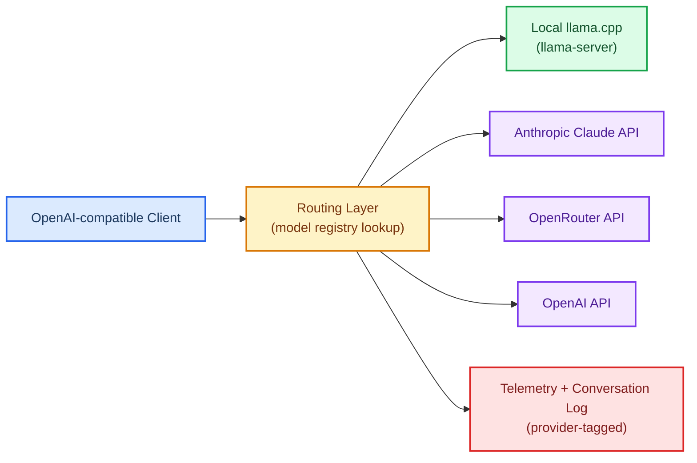

# issue-00000001: Add External Provider Routing

| Field       | Value                             |
| ----------- | --------------------------------- |
| **ID**      | issue-00000001                    |
| **Type**    | Feature Request                   |
| **Status**  | Open                              |
| **Project** | WLM-001 External Provider Routing |
| **Branch**  | feat/external-provider-routing    |
| **Created** | 2026-02-19                        |
| **Author**  | borealBytes                       |

## 🎯 Summary

WebLlamaManager manages local llama.cpp/GGUF model instances and exposes an OpenAI-compatible completions proxy. This issue requests a routing layer that inspects the `model` field of incoming requests and forwards them to either the local llama-server or a configured external provider (Anthropic Claude, OpenRouter, OpenAI), while unifying telemetry, conversation logging, and request tracking across all backends.

## 🔍 Problem Statement

Users need to blend local inference with cloud-hosted models without running separate clients or endpoints. Current limitations:

- The completions proxy targets only the local `llama-server`; no model-based dispatch exists.
- `.env.example` contains no external provider key fields.
- Telemetry and conversation logs lack a `provider` dimension, preventing cross-provider analysis.
- The UI model list is local-only.

## 🚀 Proposed Solution

Add a provider-aware routing layer that:

1. Maintains a configurable model-to-provider registry (env-driven).
2. Inspects `model` in each completions request and selects a backend.
3. Forwards to local llama.cpp or the appropriate external provider API.
4. Injects the correct API key server-side from env vars.
5. Streams SSE responses back to the client without buffering.
6. Tags all telemetry and conversation log entries with a `provider` field.
7. Merges local and external model lists in the UI.

### Routing Architecture

## 📋 Acceptance Criteria

- [ ] Provider registry is configurable via `.env` (model-to-provider map).
- [ ] Routing logic correctly dispatches to local or external backend.
- [ ] SSE streaming passes through transparently for all providers.
- [ ] API keys are injected server-side; never exposed to clients.
- [ ] Telemetry and conversation log records include a `provider` field.
- [ ] UI model list reflects all active provider models (merged list).
- [ ] Documentation updated with new env vars and routing configuration.

## 🔗 References

- [WLM-001 Kanban Board](../kanban/project-wlm-001-external-provider-routing.md)
- [PR-00000001 Record](../pr/pr-00000001-external-provider-routing.md)
- Upstream: [yolanother/WebLlamaManager](https://github.com/yolanother/WebLlamaManager)
