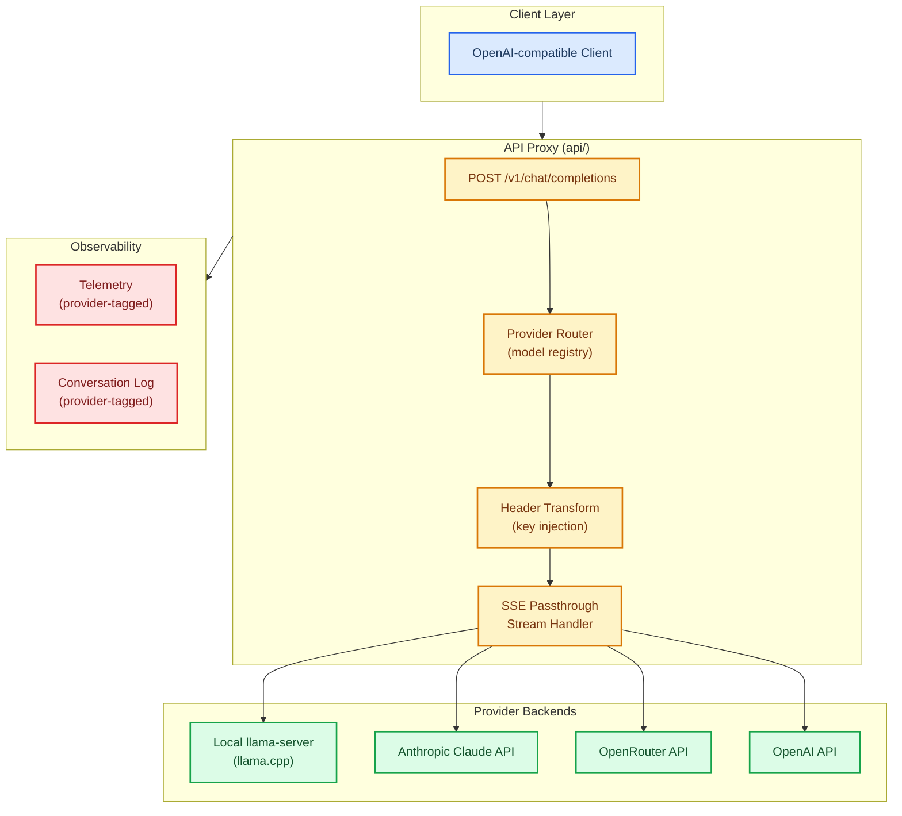

# pr-00000001: Add External Provider Routing

| Field       | Value                                                                                       |
| ----------- | ------------------------------------------------------------------------------------------- |
| **ID**      | pr-00000001                                                                                 |
| **Title**   | feat(routing): add external provider routing layer for multi-backend completions            |
| **Status**  | Draft                                                                                       |
| **Branch**  | `borealBytes:feat/external-provider-routing` → `yolanother:main`                           |
| **PR URL**  | _pending creation_                                                                          |
| **Issue**   | [issue-00000001](../issues/issue-00000001-add-external-provider-routing.md)                 |
| **Kanban**  | [project-wlm-001](../kanban/project-wlm-001-external-provider-routing.md)                  |
| **Created** | 2026-02-19                                                                                  |
| **Author**  | borealBytes                                                                                 |

## 🎯 Scope

This PR introduces planning artifacts for a provider-aware routing layer in WebLlamaManager. The routing layer will intercept incoming OpenAI-compatible completions requests, inspect the `model` field, consult a configurable provider registry, and forward the request to either the local llama.cpp instance or an external provider API (Anthropic Claude, OpenRouter, OpenAI). All providers share a unified telemetry and conversation log pipeline tagged with a `provider` field. **This commit adds only planning documentation; implementation follows in subsequent PRs.**

## 🏗️ Architecture

## 🔒 Security Checklist

- [ ] API keys loaded exclusively from server-side env vars (`ANTHROPIC_API_KEY`, `OPENROUTER_API_KEY`, `OPENAI_API_KEY`).
- [ ] No API keys returned in API responses or logged in plain text.
- [ ] Client `Authorization` headers stripped/replaced before forwarding to external providers.
- [ ] `.env.example` uses clearly fake placeholder values only.
- [ ] External provider errors do not leak internal key values in error responses.

## 🧪 Test Plan

- [ ] Unit: provider registry lookup (exact match, prefix match, fallback to local).
- [ ] Unit: header transform (key injection, client auth removal).
- [ ] Integration: SSE stream from local llama-server passes through correctly.
- [ ] Integration: SSE stream from OpenRouter API passes through correctly (mock or live).
- [ ] Integration: telemetry records contain `provider` field for each backend type.
- [ ] UI: model list displays merged local and external provider models.

## 🔄 Rollback Plan

This planning-only commit contains no implementation changes. If the feature is abandoned:

1. Close this PR without merging.
2. Move all kanban items in `project-wlm-001` to **Won't Do** with reason.
3. Update `issue-00000001` status to `Closed - Not Planned`.

## 👥 Reviewer Checklist

- [ ] Architecture diagram accurately reflects the intended implementation approach.
- [ ] Security checklist covers all API key-handling risks.
- [ ] Acceptance criteria in `issue-00000001` are complete and testable.
- [ ] Kanban backlog items align with acceptance criteria (no gaps).
- [ ] Conventional commit scope is correct: `feat(routing):`.

## 📝 Notes

- **Local CI:** Not applicable for this planning-only commit (no linting targets). Skip documented per AGENTS.md operational readiness policy.
- **No ADR required** for this PR — routing architecture decisions will be captured in a dedicated ADR during implementation.
- Target: `yolanother:main` (upstream). Source: `borealBytes:feat/external-provider-routing`.
